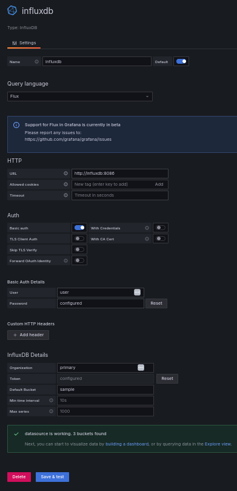

# Docker and Grafana Installation Guide

This guide will walk you through the process of installing Docker and running a Grafana container on your local machine.

## Prerequisites

Ensure that you have a compatible operating system. Docker Desktop is compatible with Windows 10 64-bit: Pro, Enterprise, or Education (Build 15063 or later), and macOS Sierra 10.12 or later.

## Installing Docker

### For Windows

1. Download Docker Desktop for Windows from the [Docker Hub](https://hub.docker.com/editions/community/docker-ce-desktop-windows/).
2. Double-click Docker Desktop Installer.exe to run the installer.
3. Follow the instructions in the installer to authorize the installer and proceed with the install.

### For MacOS

1. Download Docker Desktop for Mac from the [Docker Hub](https://hub.docker.com/editions/community/docker-ce-desktop-mac/).
2. Double-click Docker.dmg to open the installer, then drag the Docker icon to the Applications folder.
3. Open Docker from the Applications folder.

Sure, here's how you can add instructions for installing Docker on Linux to your README:

## Installing Docker

### For Linux

1. Update your existing list of packages:

```bash
sudo apt-get update
```

2. Install a few prerequisite packages which let apt use packages over HTTPS:

```bash
sudo apt-get install apt-transport-https ca-certificates curl software-properties-common
```

3. Add the GPG key for the official Docker repository to your system:

```bash
curl -fsSL https://download.docker.com/linux/ubuntu/gpg | sudo apt-key add -
```

4. Add the Docker repository to APT sources:

```bash
sudo add-apt-repository "deb [arch=amd64] https://download.docker.com/linux/ubuntu $(lsb_release -cs) stable"
```

5. Update the package database with the Docker packages from the newly added repo:

```bash
sudo apt-get update
```

6. Make sure you are about to install from the Docker repo instead of the default Ubuntu repo:

```bash
apt-cache policy docker-ce
```

7. Finally, install Docker:

```bash
sudo apt-get install -y docker-ce
```

8. Docker should now be installed, the daemon started, and the process enabled to start on boot. Check that it's running:

```bash
sudo systemctl status docker
```

After these steps, you can proceed with the "Running Grafana in Docker" section as the commands are the same across all platforms.

## Running Grafana in Docker

1. Open a terminal window.
2. Create a docker network for the containers to use. This is required for grafana to communicate with influxdb. 
```
docker network create mynetwork 
```

2. Run the following command to download and run the Grafana Docker image on your local machine:

```
docker run -d --network=mynetwork -p 3000:3000 --name=grafana grafana/grafana
```

This command will download the Grafana Docker image if it's not already downloaded, and run it. The `-d` flag tells Docker to run the container in the background. The `-p` flag maps the port 3000 of your local machine to the port 3000 in the Docker container where Grafana is running.

3. Open a web browser and navigate to `http://localhost:3000`. You should see the Grafana login page.

4. Log in with the default Grafana credentials: `admin` for the username and `admin` for the password.

You now have Grafana running in a Docker container on your local machine! You can start creating dashboards and visualizing data.

# Alternatives

If you prefer not to use Docker, you can also install Grafana directly on your machine. Refer to the [official Grafana installation guide](https://grafana.com/docs/grafana/latest/installation/) for more information.

Or use a cloud-based Grafana service like [Grafana Cloud](https://grafana.com/products/cloud/).

## Docker Alternatives

If you're looking for alternatives to Docker, you can explore other containerization platforms like Podman, LXC, or LXD.  Podman has a similar interface to Docker and is compatible with Dockerfiles and Docker images. They have also recently added Podman desktop for a more user-friendly experience.

# Running / Connecting Grafana to Influx

Docker containers can communicate with each other through several methods, but the most common way is by using Docker networks. Here's a step-by-step guide on how to do it:

1. Create a new Docker network:

```bash
docker network create mynetwork
```

2. Run your containers in the created network. For example, if you have a Grafana container and an InfluxDB container, you can run them like this:

```bash
docker run -d --network=mynetwork -p 3000:3000 --name=grafana grafana/grafana
docker run -d --network=mynetwork -p 8086:8086 --name=influxdb influxdb:latest
```

Now, these two containers are in the same network and can communicate with each other using their container names as hostnames. For example, from the Grafana container, you can reach the InfluxDB container at `http://influxdb:8086`.

Remember to replace the placeholders with your actual values.

# Notes

The organization and bucket you set during the influx db onboarding UI should be what you enter in the grafana data source configuration ui.

***If you would like to persist your data in grafana or influx between container runs, you will need to mount a volume in docker according to the container requirements.***

# Screenshot



